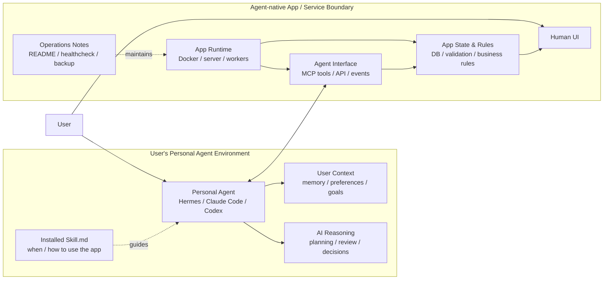

# Agent-native App

> A working note on keeping app state inside apps, while letting a user's personal agent handle the AI parts.

Language / 語言： [繁體中文](#繁體中文) | [English](#english)

---

## Architecture at a glance / 架構圖



```text
App owns state and deterministic behavior.
Agent owns user context and AI reasoning.
```

---

## 繁體中文

### 這份筆記在說什麼

這不是在宣告一個新標準，也不是要發明一套 framework。

這只是整理我在把自架服務接到 Personal Agent 時，逐漸形成的一個實作邊界：

```text
服務自己保存資料、提供 UI/API/MCP；
需要 AI 判斷時，交給使用者原本就在用的 Agent。
```

目標很務實：保持 agent home 乾淨、避免每個 App 都內建一套 chatbot/agent lifecycle，同時讓服務不綁定特定 Agent。

---

### 來由

這個模式來自實際使用 Hermes Agent 建立多個自架服務的經驗，例如入口頁、File Browser、Mochi Office、S400 健康儀表板、Mochi Quest。

遇到的問題：

1. **Agent 目錄變髒**
   - 一開始把服務的 runtime data、DB、cache、uploads 都塞在 agent home 裡，agent 目錄很快變亂。

2. **服務需要 AI，但不該各自養 Agent**
   - 像 Mochi Quest 需要 AI 拆目標、調整任務、判斷 reward 衝突。
   - 但每個 App 都內建 agent lifecycle，會重複管理 memory、prompt、permission、排程與治理。

3. **SaaS + Skill 不夠彈性**
   - Skill 會依賴 SaaS 的資料模型與限制。
   - 做成通用 Skill 又太抽象，也不容易擴充成自己想要的系統。

最後形成的邊界：

```text
App：UI / data / API / MCP server / validation / runtime state
Personal Agent：user context / reasoning / planning / AI decisions / cross-app orchestration
```

服務包成 Docker 獨立運行，資料留在服務自己的邊界內；Agent 目錄只安裝 Skill、connector、config。這樣 agent home 保持乾淨，服務也不依賴特定 Agent。Hermes Agent、Claude Code、Codex 或其他 MCP-capable agent 都可以接入。

這些服務不用在這份筆記裡展開成完整案例，但可以作為脈絡：

- **入口頁**：把多個自架服務整理成一個人類可點的入口。
- **File Browser**：Hermes Agent 目錄的 File Browser，讓人可以直接瀏覽與管理 agent home。
- **Mochi Office**：Hermes Agent profile 的視覺化介面。
- **S400 健康儀表板**：自動同步體脂計資料，並讓 Agent 可以讀取我的健康資料。
- **Mochi Quest**：將個人目標化為可實踐的任務，是最接近完整範例的服務。Repo: <https://github.com/ATaiIsHere/mochi-quest>

---

### 簡化後的組成

不用一開始就寫完整規格。先有最小可用模式即可。

1. **App Runtime：服務怎麼跑**
   - Docker / Compose、API server、DB、Web UI、workers。

2. **App State & Rules：App 自己保證什麼**
   - 資料模型、狀態、validation、權限、business rules、migration。
   - 這些通常已在程式碼內，不一定一開始就要獨立成文件。

3. **Agent Interface：Agent 怎麼操作 App**
   - MCP tools、HTTP API、events / webhooks、structured schemas。

4. **Agent Instructions：Agent 該怎麼用 App**
   - `SKILL.md`：什麼時候該用、怎麼判斷、怎麼寫回、哪些動作需要 human approval。
   - 目前這就是給 Agent 看的標準 context file；不要額外發明沒有人讀的規格檔。

5. **Operations Notes：怎麼維護 App**
   - 安裝、更新、healthcheck、backup、restore、migration、rollback。
   - 早期可寫在 README；成熟後再拆 RUNBOOK。

---

### 最小可用模式

```text
必備：
- Docker / Compose 或等價 runtime
- API 或 MCP tools，讓 Agent 可以讀取與操作
- Human UI 或可檢查的狀態
- SKILL.md 或等價的 Agent instructions
- README：說明 setup、運作方式、基本維護

成熟後可選：
- app.yaml manifest
- RUNBOOK.md
- events / webhooks
- evals / permission policy
```

---

### Mochi Quest 對應範例

目前 Mochi Quest 可以這樣對應：

- **App Runtime**：Dockerized server，包含 API / DB / UI / MCP server。
- **App State & Rules**：goals、tasks、rewards、streaks、wallet、assessments、task ledger、active plan state、API validation。主要存在 server code 內，尚未獨立寫成「系統保證」文件。
- **Agent Interface**：MCP tools 和 API endpoints，讓 Personal Agent 可以查詢、完成任務、產生計畫、調整 reward review。
- **Agent Instructions**：`SKILL.md` 描述何時建立 goal、產生 plan、replan、complete task、review reward、問使用者。這就是目前給 Agent 看的主要 context file。
- **Operations Notes**：部署與維運方式還在演進，未來可整理成更清楚的 README / RUNBOOK。

這代表 Mochi Quest 不需要內建自己的 Agent。它只需要提供資料、UI、API、MCP tools 和 Skill；使用者自己的 Agent 會接手 AI reasoning。

---

### 不是什麼

Agent-native App 不是：

- App 內建 chatbot
- 每個 SaaS 自己的 AI assistant
- MCP 的替代品
- 新的 agent framework
- 新的 LLM runtime
- Hermes 專屬 convention

它是一種應用模式：讓 App 保持可靠狀態與服務邊界，讓使用者的 Personal Agent 成為可替換、可治理、跨 App 的 AI runtime。

---

## English

### What this note is about

This is not a claim of a new standard, and not an attempt to introduce a new framework.

It is a working note about a boundary I arrived at while wiring self-hosted services into a Personal Agent:

```text
Services keep their own data and expose UI/API/MCP;
when AI judgment is needed, delegate it to the user's existing agent.
```

The practical goal is simple: keep the agent home clean, avoid embedding a chatbot/agent lifecycle into every app, and keep services portable across different agents.

---

### Origin

This pattern came from running Hermes Agent with multiple self-hosted services: an entry page, File Browser, Mochi Office, S400 health dashboard, and Mochi Quest.

The problems:

1. **The agent home became messy**
   - Runtime data, databases, caches, uploads, and generated files lived inside or too close to the agent home directory.

2. **Services needed AI, but should not own an agent lifecycle**
   - Apps like Mochi Quest need AI to break down goals, adjust tasks, and review reward conflicts.
   - But embedding a separate agent lifecycle into every app duplicates memory, prompts, permissions, scheduling, and governance.

3. **SaaS + Skill was not flexible enough**
   - Skills become tightly coupled to SaaS-specific data models and limitations.
   - Generic Skills often become too abstract.

The cleaner boundary became:

```text
App: UI / data / API / MCP server / validation / runtime state
Personal Agent: user context / reasoning / planning / AI decisions / cross-app orchestration
```

Each service runs independently, usually as a Dockerized app. App data stays inside the app boundary. The agent home only installs Skills, connectors, and config. This keeps the agent environment clean and makes the app independent from a specific agent implementation. Hermes Agent, Claude Code, Codex, or other MCP-capable agents can connect to it.

These services do not need to become full case studies in this note, but they provide the background:

- **Entry page**: a human-facing entry point for multiple self-hosted services.
- **File Browser**: a File Browser for the Hermes Agent directory, so the agent home can be browsed and managed directly.
- **Mochi Office**: a visual interface for Hermes Agent profiles.
- **S400 health dashboard**: automatically syncs body scale data and lets the Agent read my health data.
- **Mochi Quest**: turns personal goals into actionable tasks, and is the closest complete example. Repo: <https://github.com/ATaiIsHere/mochi-quest>

---

### Simplified components

An Agent-native App does not need a full specification on day one. Start with a minimal usable pattern.

1. **App Runtime: how the service runs**
   - Docker / Compose, API server, database, Web UI, workers.

2. **App State & Rules: what the app guarantees**
   - Data model, state, validation, permissions, business rules, migrations.
   - These rules often already exist in code and do not need a separate document at first.

3. **Agent Interface: how the agent operates the app**
   - MCP tools, HTTP APIs, events / webhooks, structured schemas.

4. **Agent Instructions: how the agent should use the app**
   - `SKILL.md`: when to use the app, how to decide, how to write back, and which actions require human approval.
   - This is the current standard context file for agents. Do not invent an extra spec file unless real tooling will read it.

5. **Operations Notes: how the app is maintained**
   - Setup, update, healthcheck, backup, restore, migration, rollback.
   - Early apps can keep this in README. Mature apps may split it into a RUNBOOK.

---

### Minimal usable pattern

```text
Required:
- Docker / Compose or equivalent runtime
- API or MCP tools for agent access
- Human UI or inspectable state
- SKILL.md or equivalent agent instructions
- README with setup and basic operations notes

Optional as the app matures:
- app.yaml manifest
- RUNBOOK.md
- events / webhooks
- evals / permission policy
```

---

### Mochi Quest mapping

Mochi Quest currently maps to the pattern like this:

- **App Runtime**: Dockerized server with API / DB / UI / MCP server.
- **App State & Rules**: goals, tasks, rewards, streaks, wallet, assessments, task ledger, active plan state, API validation. These mostly exist in server code today and have not been extracted into a separate “system guarantees” document.
- **Agent Interface**: MCP tools and API endpoints let the Personal Agent read state, complete tasks, generate plans, and review rewards.
- **Agent Instructions**: `SKILL.md` describes when to create goals, generate plans, replan, complete tasks, review rewards, and ask the user. It is the main context file for agents today.
- **Operations Notes**: deployment and operations notes are still evolving and can later become a clearer README / RUNBOOK.

This means Mochi Quest does not need to embed its own agent. It only needs to expose data, UI, APIs, MCP tools, and a Skill. The user's personal agent handles the AI reasoning.

---

### What this is not

Agent-native App is not:

- an app with an embedded chatbot
- a SaaS-specific AI assistant
- a replacement for MCP
- a new agent framework
- a new LLM runtime
- a Hermes-only convention

It is an application pattern that keeps apps as reliable service boundaries and lets the user's Personal Agent become a replaceable, governable, cross-app AI runtime.

---

## License

MIT. See [`LICENSE`](LICENSE).
